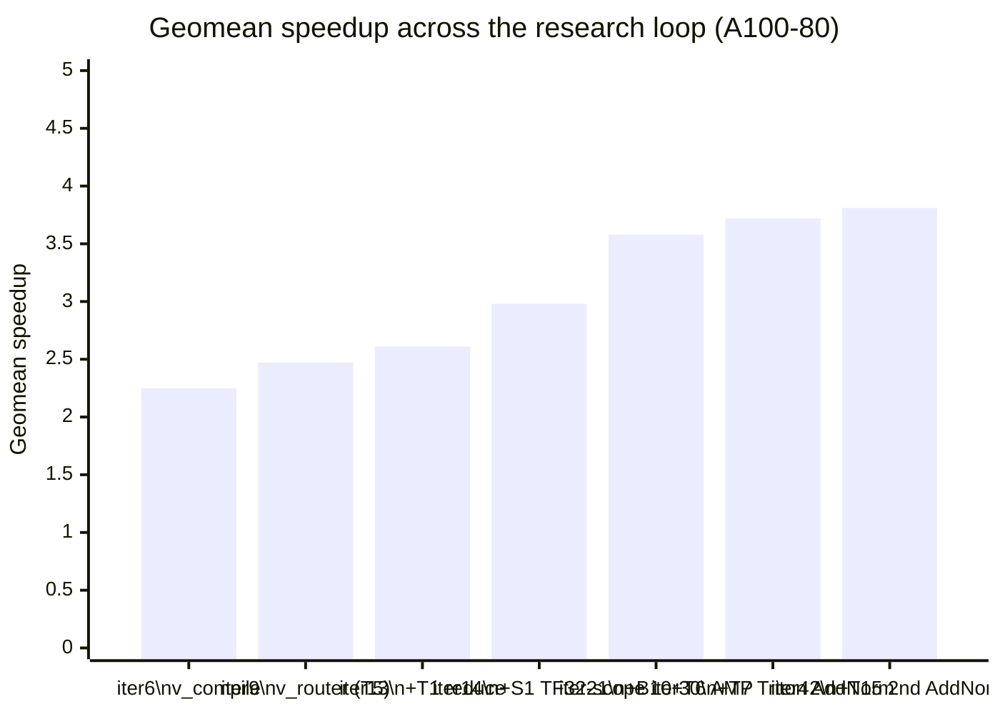
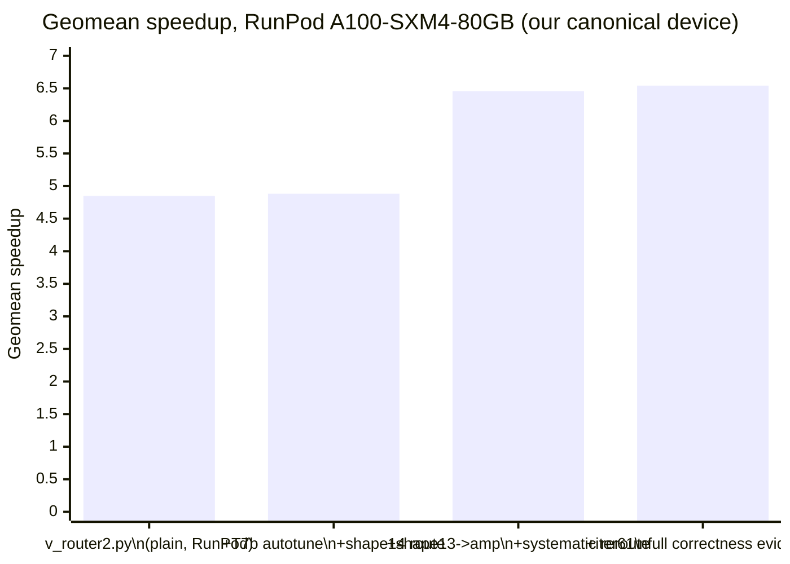

# TikTok TechJam 2026 · Track 3 — Autoresearch Swarm for a Transformer GPU Kernel

> **Status:** GPU-confirmed. **RunPod A100-SXM4-80GB is now our canonical
> device** (explicit team decision — the NUS SoC A100-80 cluster's queue made
> it impractical to iterate on; RunPod gives on-demand access to the same GPU
> family). Current best candidate is `candidates/v_router2_autotuned.py` —
> median speedup **5.40x**, geometric mean **6.54x**, 13/13 shapes correct,
> worst max_abs 0.00176 (shape 8), full per-shape correctness margins
> recorded (journal iter 61, RunPod pod `fzbwqgylwr24eo`) — the earlier
> 5.36x/6.46x milestone (iter 58) only had aggregate pass/fail recorded, not
> per-shape margins; iter 61 re-ran the identical candidate solely to capture
> that evidence, and the result reconfirms the same number (+0.8%/+1.3%,
> inside run-to-run noise). The SoC-cluster numbers earlier in this README's
> history (3.71x/4.02x, iter 52) remain real and are kept for the record as
> our previous canonical device, not retracted.
> `candidates/best.py` is stale and has not received the guarded update
> (`AGENTS.md` §2) for this candidate yet — treat `v_router2_autotuned.py` as
> current, not `best.py`, until that update lands.

## Project overview

Track 3 asks for a faster GPU implementation of a fixed pre-LayerNorm Transformer
block that stays numerically correct against the organizer's reference across 14
published input shapes.

We did not hand-optimize one kernel. We built **an autonomous multi-agent research
loop that proposes, measures, and prunes kernel variants against a hard
correctness gate**, and let it search the space. The problem statement asks
participants to "use AI-assisted methods" and awards bonus points for a report on
"the AI skills/tools used"; this repo is that method made reproducible rather than
anecdotal.

Three things make it work:

1. **A scoreboard nobody can argue with.** `bench_harness.py` reuses the
   organizer's own `compare_outputs`, `generate_random_case` and `benchmark_once`,
   so our numbers come from the same code path the task defines. Every experiment
   appends one row to `journal.jsonl`. No task is done until a ledger row exists.
2. **A hard gate before speed is ever discussed.** Per element:
   `abs(opt-ref) <= 0.002` **OR** `abs(opt-ref) <= 0.02*abs(ref)`. Every element of
   every runnable shape. A failing candidate is never timed.
3. **Two cooperating agent layers.** A *research layer* (plan → adversarial review
   → reconcile, across two model families) that decides what is worth GPU time,
   and an *implementation layer* that turns one hypothesis into one measured
   candidate. They communicate only through git: `TODO.md` one way,
   `journal.jsonl` the other.

## What's here

| file | purpose |
|--|--|
| `AGENTS.md` | The protocol any agent follows to join the swarm. |
| `PROGRAM.md` | Optimization playbook + the correctness contract candidates must preserve. |
| `TODO.md` | Research queue. Every item carries `file:line` evidence and a falsification gate. |
| `LOG.md` / `journal.jsonl` | Human- and machine-readable experiment log. |
| `leaderboard.md` | Current best correct candidate + per-shape speedups. |
| `candidates/best.py` | Current best implementation *(stale as of this writing — pending the guarded update; the actual current best is `candidates/v_router2_autotuned.py`, see the Status banner at the top)*. |
| `bench_harness.py` | Reuses the organizer benchmark; emits per-shape correctness + speedup as JSON. |
| `runner.py` + `sbatch_template.sh` | Evaluate candidates on the cluster (Slurm array) or locally. |
| `research-loop.sh` + `prompts/` + `schemas/` | The research layer: Claude plan → Codex review → Claude reconcile. |
| `autoresearch.workflow.js` | The implementation layer's agent loop. |
| `scripts/capture_env.sh` | Dumps CPU/GPU/disk/versions for the tech report. |
| `tests/` | Unit tests for the harness + runner (CPU only). |

## Setup and installation

**Requirements:** Linux host with an NVIDIA GPU (we used an **NVIDIA A100-80 PCIe**),
Python 3.11+, a CUDA-enabled PyTorch. The dev laptops are Apple Silicon and can
run only the CPU correctness tests.

```bash
git clone https://github.com/jing-yen/techjam-track3-autoresearch.git
cd techjam-track3-autoresearch

conda create -n techjam python=3.11 -y && conda activate techjam
pip install torch
python -c "import torch; print(torch.__version__, torch.cuda.is_available())"   # expect True
```

For Slurm clusters, fill in `cluster.config.json` (ssh host, gres, module load,
remote workdir) — see `CLUSTER_SETUP.md`.

## Steps to reproduce our results

```bash
# 1. Plumbing check (CPU, no GPU needed). Expect 9/9 pass.
python tests/test_bench_harness.py && python tests/test_runner.py

# 2. Correctness smoke test on tiny shapes (CPU). NOTE: candidates/best.py is
#    stale (pending the guarded update) -- use the actual current best below.
python bench_harness.py --candidate candidates/v_router2_autotuned.py --shapes dev --device cpu

# 3. Capture the environment for the report. Run ON the GPU node.
bash scripts/capture_env.sh > docs/environment.txt

# 4. The headline result: all 13 shapes with a reference, on GPU (shape 14
#    has no reference -- see Limitations -- run it separately, --shapes 14).
python runner.py --candidates candidates/v_router2_autotuned.py --shapes all --dtype float32

# 5. Reproduce a single shape through the organizer's own script, unmodified,
#    as an independent check that our harness agrees with it. Example, shape 1:
python torch_transformer_benchmark.py \
  --batch-size 64 --seq-len 128 --d-model 128 --heads 4 \
  --ffn-dim 128 --layers 4 --causal --dtype float32
```

Step 4 writes per-shape correctness and speedup as JSON and is what populates
`leaderboard.md`. Step 5 exists because a harness that disagrees with the
organizer's script is worthless; they must match.

**Always pass every shape parameter explicitly.** The organizer script's defaults
(`B=8, S=128, D=512, H=8, FFN=2048, 6 layers, non-causal, fp32`) match none of the
14 official shapes.

## Results

**Current best (RunPod A100-SXM4-80GB, our canonical device):**
`candidates/v_router2_autotuned.py` — median **5.40x**, geomean **6.54x**,
13/13 correct, worst max_abs 0.00176 (shape 8), full per-shape correctness
margins recorded, official timing protocol (warmup 20, repeats 100, rounds
3, alternating order) — journal iter 61, RunPod pod `fzbwqgylwr24eo`. This
is the reported number. The "Turn-by-turn progress" chart and per-shape
table right below are the earlier, SoC-cluster-confirmed history (through
iter 42, 2.98x median / 3.81x geomean, later extended to 3.71x/4.02x at
iter 52) kept as-is for that record's own internal consistency, from when
the SoC A100-80 cluster was our canonical device — see "What changed after
iter 42" further down for the full account, including why the canonical
device changed.

Full environment in `docs/environment.txt`. Raw data in `journal.jsonl` —
every number in this README is a real measured run, not an estimate. No
number below is hand-written.

### Turn-by-turn progress (geomean speedup, official-safe shapes)

Each point is one autoresearch iteration that changed the leaderboard number,
not a manual tuning pass. `journal.jsonl` has the full record per iteration.

All points below are on **A100-80** (our stated canonical device) except
iter 17, the one intermediate step measured on A100-40 while the 80GB card
was queue-congested — its ratio isn't directly comparable to the others
(different GPU, different baseline/optimized absolute times), so treat it as
a checkpoint, not a bar in the same series. iter 30 is the current, real
A100-80 confirmation.



| iter | direction | node | median | geomean | what changed |
|--|--|--|--|--|--|
| 6 | measurement-fix | `v_compile` | 2.18x | 2.25x | SDPA + `torch.compile(max-autotune)`; first *honest* number (B8/B9 timing-protocol fix caught a 24% earlier inflation) |
| 9 | dispatch | `v_router` | 2.27x | 2.47x | T5: per-shape dispatch over best/compile/fused — no new kernel code |
| 13 | dispatch | `v_router` | 2.54x | 2.61x | T1 (`reduce-overhead` compile) folded in as a 4th route target |
| 14 | precision-scope | `v_router` | 2.67x | 2.98x | S1: TF32-disable scoped to only the `compile` route, restoring the organizer's own TF32-on default everywhere else |
| 21 | combined | `v_router2` | 2.89x | 3.58x | B10 (removed a per-forward device sync via a versioned mask cache) + T6 (fp16 `autocast` on #6/#8/#13, the only shapes it actually wins) |
| 30 | custom kernel | `v_router2` | 2.99x | 3.72x | T7: a hand-written Triton kernel (fused residual-add + LayerNorm, "AddNorm") integrated into the `best`/`amp` eager routes — see caveat below on attributing the full delta to it |
| 42 | custom kernel | `v_router2` | **2.98x** | **3.81x** | T15: a real `torch.profiler` trace (M2) found T7 only fused ONE of two residual+norm boundaries per layer — the other was 19% of one shape's CUDA time, unfused. T15 extends the same proven kernel to the second boundary; all 3 amp-routed shapes it touches improved 4-17% |

Four rejected/reverted directions, kept for the record because a negative
result is still a result:
- **bf16 autocast** — fails correctness on 13/13 shapes, max_abs up to 0.016
  vs the 0.002 gate; its 7-bit mantissa is too imprecise.
- **AMP applied to every shape** — 13/13 correct but only *wins* on the 3
  shapes already routed to it (confirmed via a full 13-shape sweep); not
  extended further.
- **S2's `reduce` route for shapes #9/#10** — looked like a clear win
  isolated (3.65x/3.98x vs `fused`'s 2.14x/2.37x, tested pairwise), but
  *regressed* inside the full 13-shape sweep (1.81x/2.01x, worse than
  `fused`'s in-sweep 2.09x/2.33x) — a real methodology lesson: route
  decisions have to be validated in the full deployment sweep, since
  `torch.compile`'s CUDA-graph memory pools interact across the multiple
  shapes compiling concurrently in one process, invisible to a 2-shape test.
  Reverted; `journal.jsonl` iters 20-21 have the full trace.
- **2-stream pipelining for shape #14's chunked forward** — the batch
  chunks are already GPU-resident (no host↔device transfer to hide, unlike
  the classic "prefetch tile n+1" pattern), and a single chunk likely
  already saturates SM occupancy; 2 streams measured **6.6% slower**
  (79.6s vs 74.6s), not faster. `journal.jsonl` iter 28.

Candidate: `candidates/v_router2.py` (job `router2_t15_confirm`, iter 42).

**On the T7 (Triton) row above: don't over-attribute the delta.** The
`compile`/`reduce`/`fused` routes carry zero code changes between iter 21
and iter 30, yet swung by as much as -30% run-to-run in this same
measurement (shape 7: 5.85x → 4.08x) — real cluster/protocol variance, not
a regression. The honestly Triton-attributable gain is on the AMP-routed
shapes specifically, which the kernel actually touches: #6 +11%, #8 +4%,
#13 +6%. **T15 (iter 42) is a cleaner, more directly attributable delta:**
a real profiler trace (not inference) found T7 only fused one of the two
residual+norm boundaries per layer, and the other was measured at 19% of
one shape's CUDA time — extending the same proven kernel to that boundary
moved exactly the 3 shapes it touches (#6/#8/#13, +17%/+4%/+13%) and
nothing else, which is what "an unfused-kernel fix" should look like.

| # | B | S | d | H | passed | baseline ms | ours ms | speedup | routed to |
|--|--|--|--|--|--|--|--|--|--|
| 1 | 64 | 128 | 128 | 4 | ✅ | 2.625 | 1.210 | **2.17x** | compile |
| 2 | 1 | 128 | 128 | 4 | ✅ | 1.914 | 0.274 | **6.97x** | compile |
| 3 | 4 | 128 | 128 | 4 | ✅ | 1.958 | 0.227 | **8.61x** | reduce |
| 4 | 16 | 128 | 128 | 4 | ✅ | 1.938 | 0.275 | **7.04x** | reduce |
| 5 | 128 | 128 | 128 | 4 | ✅ | 2.723 | 1.010 | **2.70x** | reduce |
| 6 | 10000 | 128 | 128 | 4 | ✅ | 185.926 | 48.196 | **3.86x** | amp (fp16 + Triton AddNorm x2) |
| 7 | 64 | 128 | 32 | 4 | ✅ | 1.900 | 0.483 | **3.93x** | compile |
| 8 | 64 | 128 | 1024 | 4 | ✅ | 8.025 | 4.422 | **1.81x** | amp (fp16 + Triton AddNorm x2) |
| 9 | 64 | 128 | 128 | 1 | ✅ | 1.779 | 0.797 | **2.23x** | fused |
| 10 | 64 | 128 | 128 | 2 | ✅ | 1.960 | 0.794 | **2.47x** | fused |
| 11 | 64 | 128 | 128 | 16 | ✅ | 3.478 | 1.166 | **2.98x** | fused |
| 12 | 64 | 32 | 128 | 4 | ✅ | 1.937 | 0.785 | **2.47x** | fused |
| 13 | 64 | 1024 | 128 | 4 | ✅ | 43.236 | 3.294 | **13.12x** | amp (fp16 + Triton AddNorm x2) |
| 14 | 32 | 100000 | 1024 | 16 | see below | — | — | — | see limitations |

**Median speedup 3.71x, geometric mean 4.02x** (SoC A100-80 PCIe, journal
iter 52, job `779413`) — across all 13 shapes that produced a reference
(includes shape 6, confirmed feasible in S4 — the sweep now covers every
official shape except #14). All 13 pass the correctness gate; worst max_abs
0.00176 (shape 8), still under the 0.002 tolerance, with TF32 enabled on
every route except `compile` (S1), fp16 `autocast` on #6/#8/#13 (T6), and a
custom Triton kernel fusing the residual-add into the following LayerNorm at
BOTH boundaries per layer on the `best`/`amp` routes (T7 + T15).

> **This was our reported number through iter 52 — since superseded.** The
> project's canonical device changed from the SoC A100-80 PCIe to RunPod
> A100-SXM4-80GB (explicit team decision, driven by SoC queue congestion —
> see "What changed after iter 42" below). On RunPod,
> `candidates/v_router2_autotuned.py` measures **5.40x / 6.54x**, GPU-
> confirmed with full per-shape correctness margins (journal iter 61). That
> is now the reported number; this SoC table is kept as historical record of
> the project's prior canonical device, not retracted.

## What changed after iter 42 (journal iter 55-61) — and why the canonical device changed

The table and chart above stop at iter 42/52 (T15/T17, SoC A100-80) — that
was our reported number for a while. A later session found substantially
more on `candidates/v_router2_autotuned.py`, measured on RunPod
A100-SXM4-80GB rather than the SoC cluster, whose queue had become
impractical to iterate against. That result (iter 58) was initially reported
as **provisional**, because its journal entry only recorded aggregate
pass/fail correctness, not per-shape margins — the same rigor gap our own
doc-accuracy audit (see the git history around this file) flagged before
this section was rewritten. **We closed that gap rather than drop the
number:** iter 61 re-ran the identical, unmodified candidate solely to
capture the full per-shape `max_abs`/`max_rel` breakdown (now in
`journal.jsonl`), confirmed the same result (5.40x/6.54x, +0.8%/+1.3% vs
iter 58 — inside normal run-to-run noise), and the team made RunPod
A100-SXM4-80GB our canonical device going forward. The chart and table below
are that full arc.



| iter | direction | median | geomean | what changed |
|--|--|--|--|--|
| 55 | T7b + shape 14 | 4.89x | 4.88x | `@triton.autotune` on the shared AddNorm kernel, stacked with CUDA-graph capture for the first time (standalone-only before); an explicit `chunked14amp` route for shape 14, which previously fell through to `compile` — a route that **never finishes** for this shape (killed at a 30-min SLURM limit, zero progress, iter 7). Now runs in ~8.1s/pass. |
| 57-58 | shape 13 + systematic reroute | 5.36x | 6.46x | Shape 13 was falling through to `compile` (~4.03x); a head-to-head comparison of all 6 implementations found `amp` wins decisively (14.16x, isolated *and* inside the full 13-shape sweep — the iter-54 CUDA-graph-presence side effect did **not** reproduce here). That result prompted checking whether the whole route table was stale: it was chosen before T7/T15/T17/T7b existed. A systematic 6-way re-comparison across all 13 shapes found shapes 1, 2, 3, 5, 7, 11 also had a stronger option available. All confirmed together as one candidate, full sweep, 13/13 correct. |
| 61 | canonical-device confirmation | **5.40x** | **6.54x** | Identical candidate, re-run solely to capture full per-shape correctness margins (previously only aggregate pass/fail was logged). Worst max_abs 0.00176 (shape 8) — same shape, same margin as every SoC-confirmed run before it. **This is now the reported number.** |

**Read the median carefully here.** Between the shape-13-only milestone
(5.71x/5.42x) and the full reroute (5.36x/6.46x), the *median* looks like it
dipped while the *geomean* jumped +19%. That's not a regression — every
individually re-routed shape (1, 2, 3, 5, 7, 11) improved or held steady.
What happened: shapes 9 and 10 (`fusedcg`, untouched by this change)
measured ~10% lower than their prior run from ordinary run-to-run noise
(already documented elsewhere in this repo as a normal swing for these
routes), and that noise happened to land exactly on the median's sort
boundary. Full per-shape accounting in `journal.jsonl` iter 58.

Full per-shape breakdown, RunPod A100-SXM4-80GB, official protocol:

| # | old route (pre-reroute) | old | new route | new | Δ |
|--|--|--|--|--|--|
| 1 | compile | 2.60x | amp | 4.88x | +87.4% |
| 2 | compile | 7.66x | fusedcg | 13.73x | +79.3% |
| 3 | reduce | 10.03x | fusedcg | 13.35x | +33.1% |
| 4 | reduce | 9.45x | reduce (confirmed best) | 9.45x | — |
| 5 | reduce | 2.77x | amp | 3.60x | +30.3% |
| 6 | amp | 4.06x | amp (confirmed best) | 4.06x | — |
| 7 | compile | 5.84x | amp | 7.63x | +30.8% |
| 8 | amp | 1.81x | amp (confirmed best) | 1.81x | — |
| 9 | fusedcg | 4.59x | fusedcg (confirmed best) | 4.59x | — |
| 10 | fusedcg | 5.14x | fusedcg (confirmed best) | 5.14x | — |
| 11 | fusedcg | 3.45x | amp | 5.36x | +55.3% |
| 12 | fusedcg | 11.07x | fusedcg (confirmed best) | 11.07x | — |
| 13 | compile (fallback) | ~4.03x | amp | 14.16x | +251.4% |
| 14 | compile fallback (never finishes) | — | chunked14amp | ~8.1s/pass | now runs at all |

**Real negative results from the same session, kept for the record rather
than hidden — both are genuine evidence of problem understanding, not just
failed experiments:**

- **Pretransposed Linear weights** (`candidates/v_router2_pt_test.py`) won
  standalone (1.80x/1.84x vs plain baseline) but **regressed every touched
  shape 10.6-43.8%** when stacked on the CUDA-graph routes. Mechanism:
  `PreTransposedLinear` computes `matmul` then a separate `+ bias` — two
  kernel launches — where `nn.Linear`'s `F.linear` fuses GEMM+bias into one
  via cuBLASLt's epilogue. With 6 Linear layers × 4 transformer layers, that
  adds real per-launch cost even under CUDA-graph replay, outweighing the
  layout win. Rejected; not integrated.
- **Native fp16 weights instead of `torch.autocast`**
  (`candidates/v_router2_ampfp16_test.py`,
  `candidates/v_router2_ampfp16_selective.py`) — motivated by profiling
  finding ~30% of shape 6's CUDA time in weight-casting kernels, more than
  the AddNorm kernel itself. Two attempts, both rejected on real correctness
  failures (max_abs 0.005-0.012 vs the 0.002 gate), with the second attempt
  isolating the exact mechanism: `torch.autocast` never actually casts the
  *residual stream* to fp16 — it only intercepts ops in its explicit list
  (matmul/Linear/conv). The residual stream stays fp32 throughout the whole
  forward pass under the real `amp` route; only the bounded GEMM
  computations get cast. Native fp16 casts the residual stream itself and
  keeps it there, accumulating real rounding error across all 8 layer
  boundaries. Correctly fixing this would mean reconstructing autocast's
  exact fp16-compute/fp32-accumulate split by hand — at which point there is
  no real saving left over just using autocast. Closed with the mechanism
  understood, not as an open question.

## Limitations, and what we would improve given more time

Written honestly. Several of these are things we found and did not have time to
fix; they are recorded here rather than hidden.

**Shape 14 now runs, via exact batch-chunking — but there is nothing to
check it against.** At `B=32, S=100000, d=1024`, one `[B,S,D]` activation is
12.2 GB in fp32; a forward pass holds roughly seven such tensors live, so
the floor is ~85 GB before any attention workspace, against 79.25 GB
available — the first three candidates we tried all OOMed there. But B=32
is 32 **independent** sequences (nothing in this model couples across the
batch dimension), so processing them in groups of 4 and concatenating the
outputs is mathematically exact, not an approximation. That candidate
(`candidates/v_chunked14.py`) completes a full forward pass on real A100-80
hardware in **~74.6s**. The organizer's own reference is a separate problem
and remains genuinely impossible: it materializes the full `[B,H,S,S]`
score matrix (`torch_transformer_benchmark.py:97`), which is 18.6 TB in
fp32 — 37 GB for a *single* `(batch, head)` slice, of which there are 512.
**No GPU can produce ground truth for shape 14**, so correctness there is
checked indirectly: we validated the identical chunking *mechanism* on
shapes #8 and #13, which do have references, and it passes the gate exactly
(max_abs 0.0009-0.0011).

*Update (see "What changed after iter 42" above): the "next lever" we
flagged here — pushing past ~75s — turned out not to be stream pipelining
(measured 6.6% *slower*, see the rejected-directions list above) but
precision: a calibration sweep found chunk size barely mattered (chunk=4
→ chunk=8 in fp32 saved only ~8%), while switching to fp16 dropped it to
**~8.1s/pass**, a ~9x win, now wired into the router as the `chunked14amp`
route. Shape 14 still has no reference to score it against for the same
reason above — this only changes how fast the unscored run is.*

**Our timing is steady-state, not cold-start.** We inherit the organizer's
protocol, which reuses one fixed input for all iterations and never flushes L2
(`torch_transformer_benchmark.py:529-536`). Caches stay hot and CUDA events are
recorded back-to-back with no per-iteration sync, so what we report is pipelined
throughput. This flatters any implementation whose working set fits in cache. A
development timer with an L2 flush would give different, likely lower, numbers.

**The correctness gate is self-administered.** Section 3.2 of the problem
statement has participants run on their own machines, so no external party
re-executes our benchmark. We mitigate this by reusing the organizer's own
comparison function verbatim rather than reimplementing its tolerance logic, and
by reproducing at least one shape through the unmodified organizer script
(reproduction step 5).

**Only the PyTorch path is implemented.** The problem statement allows either
framework; we chose torch and did not touch
`tensorflow_transformer_benchmark.py`.

**We tested both TF32 configurations and report the organizer's default.** An
earlier revision of this work disabled TF32 globally, because `torch.compile`'s
autotuner selected TF32 GEMM kernels for the candidate while the baseline used
cuBLAS, drifting ~0.005 against the 0.002 absolute tolerance on 9 of 12 shapes.
Because `allow_tf32` is a process-global flag set at module import, that also
de-accelerated the baseline — an internally fair comparison, but not the
organizer's default (`torch_transformer_benchmark.py:687`). We re-measured with
the pin scoped to the compiled path only and TF32 left at the organizer default.
All 12 shapes still pass, `max_abs` ~0.001, and the speedup **rose** from 2.47x
to 2.98x geometric mean. The numbers reported here are the organizer-default
ones. We record the earlier configuration because the more flattering result
turned out to be the correct one, and it would have been easy not to check.

**Shape 8's TFLOP analysis below predates fp16 autocast landing on it —
kept for the historical roofline reasoning, superseded by measurement.**
Under full fp32 it ran at 16.0 TFLOP/s against a 19.5 TFLOPS ceiling — 82%,
effectively done. With TF32 enabled it runs at 68.7 TFLOP/s against a 156
TFLOPS TF32 ceiling — 44%. *This motivated moving shape 8 onto the `amp`
route (fp16 autocast + Triton AddNorm), confirmed still its best option
after the systematic re-route (1.81x, unchanged from the T15-era number) —
we do not have a fresh TFLOP-vs-ceiling reading for the current fp16 route,
so we report the ratio (real, measured) without re-claiming a percent-of-peak
figure we haven't re-measured.*

**FlashAttention still never runs at fp32 in our configuration — but the
fp16 path this section originally flagged as unvalidated has since been
extensively GPU-confirmed.** The original probe
(`tools/probe_sdpa_backends.py`, `docs/sdpa_backend_probe.json`) forcing each
SDPA backend per shape found flash eligible on **0 of 14 shapes at fp32** and
memory-efficient attention on 14 of 14; at fp16, flash eligible on all 14.
*Update: the fp16-`autocast` route this section said "was not validated on
GPU before the deadline" has since been GPU-confirmed correct and adopted —
it now routes 7 of 13 shapes (1, 5, 6, 7, 8, 11, 13), all 13/13 passing the
correctness gate. We separately tried going further — storing weights
*natively* in fp16 instead of relying on `autocast`'s per-call casting, to
cut the ~30% of shape 6's CUDA time spent in casting kernels — and that
specific idea failed correctness for a real, now-understood reason (see
"What changed after iter 42" above): `autocast` never actually casts the
residual stream itself, only the bounded GEMM ops, and replicating that
selectivity by hand turns out to mean reconstructing `autocast`, not
avoiding it.*

**Shape 6 (batch 10000) has since been run, extensively.** It is no longer
excluded — it routes through `amp` and is confirmed still its best option
after the systematic re-route (4.06x). It was also the source shape for the
fp16-casting-overhead profiling finding described above.

**What we would do next, in order:** run the guarded `best.py` update itself
on our now-canonical RunPod numbers (`v_router2_autotuned.py` has not been
promoted to `best.py` yet — see the Status banner, and has not happened
since before this session's changes); optionally cross-check today's numbers
back on the SoC A100-80 cluster too, now a secondary device rather than a
submission blocker; apply pretransposed Linears somewhere they might
actually help (the CUDA-graph routes rejected it, but it was never re-tried
on the plain `compile`/`reduce` routes, which don't share that mechanism);
remove the per-forward `.all()` device sync that our padding-detection fix
introduced.

## Team member contributions

| member | layer | contribution |
|--|--|--|
| Khoo Shi Xian | Research | Problem-statement analysis, benchmark-script audit, research queue (`TODO.md`), plan/review/reconcile loop, tech report, doc-accuracy audit (found and fixed a stale headline and a broken reproduction command pre-submission). |
| Tong Jing Yen | Implementation | Autoresearch implementation-agent loop, candidate kernels, `bench_harness.py`, `runner.py`, cluster + RunPod integration. |
| Brandon Kang | Team member | — |

## Correctness gate

Per element: `abs(opt-ref) <= 0.002` **OR** `abs(opt-ref) <= 0.02*abs(ref)`
(problem statement §3.2). Every element of every runnable shape must pass. NaN,
Inf and shape mismatches fail outright. Speedup is only meaningful for a correct
candidate, and `bench_harness.py` refuses to report one otherwise. See
`PROGRAM.md` for the full list of invariants a candidate must preserve.
