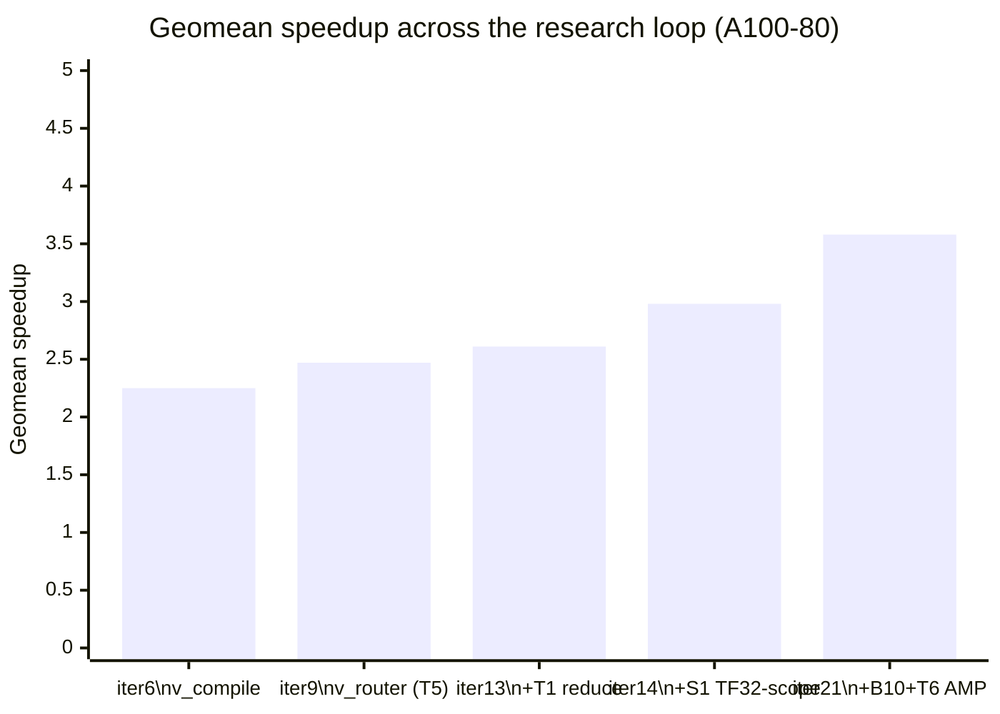

# TikTok TechJam 2026 · Track 3 — Autoresearch Swarm for a Transformer GPU Kernel

> **Status:** measurements pending first GPU run. Every number in this README and
> in `TECH_REPORT.md` marked `<FILL>` is a placeholder. **Do not submit with any
> `<FILL>` remaining.** Run `scripts/check_placeholders.sh` before you ship.

## Project overview

Track 3 asks for a faster GPU implementation of a fixed pre-LayerNorm Transformer
block that stays numerically correct against the organizer's reference across 14
published input shapes.

We did not hand-optimize one kernel. We built **an autonomous multi-agent research
loop that proposes, measures, and prunes kernel variants against a hard
correctness gate**, and let it search the space. The problem statement asks
participants to "use AI-assisted methods" and awards bonus points for a report on
"the AI skills/tools used"; this repo is that method made reproducible rather than
anecdotal.

Three things make it work:

1. **A scoreboard nobody can argue with.** `bench_harness.py` reuses the
   organizer's own `compare_outputs`, `generate_random_case` and `benchmark_once`,
   so our numbers come from the same code path the task defines. Every experiment
   appends one row to `journal.jsonl`. No task is done until a ledger row exists.
2. **A hard gate before speed is ever discussed.** Per element:
   `abs(opt-ref) <= 0.002` **OR** `abs(opt-ref) <= 0.02*abs(ref)`. Every element of
   every runnable shape. A failing candidate is never timed.
3. **Two cooperating agent layers.** A *research layer* (plan → adversarial review
   → reconcile, across two model families) that decides what is worth GPU time,
   and an *implementation layer* that turns one hypothesis into one measured
   candidate. They communicate only through git: `TODO.md` one way,
   `journal.jsonl` the other.

## What's here

| file | purpose |
|--|--|
| `AGENTS.md` | The protocol any agent follows to join the swarm. |
| `PROGRAM.md` | Optimization playbook + the correctness contract candidates must preserve. |
| `TODO.md` | Research queue. Every item carries `file:line` evidence and a falsification gate. |
| `LOG.md` / `journal.jsonl` | Human- and machine-readable experiment log. |
| `leaderboard.md` | Current best correct candidate + per-shape speedups. |
| `candidates/best.py` | Current best implementation. |
| `bench_harness.py` | Reuses the organizer benchmark; emits per-shape correctness + speedup as JSON. |
| `runner.py` + `sbatch_template.sh` | Evaluate candidates on the cluster (Slurm array) or locally. |
| `research-loop.sh` + `prompts/` + `schemas/` | The research layer: Claude plan → Codex review → Claude reconcile. |
| `autoresearch.workflow.js` | The implementation layer's agent loop. |
| `scripts/capture_env.sh` | Dumps CPU/GPU/disk/versions for the tech report. |
| `tests/` | Unit tests for the harness + runner (CPU only). |

## Setup and installation

**Requirements:** Linux host with an NVIDIA GPU (we used an **NVIDIA A100-80 PCIe**),
Python 3.11+, a CUDA-enabled PyTorch. The dev laptops are Apple Silicon and can
run only the CPU correctness tests.

```bash
git clone https://github.com/jing-yen/techjam-track3-autoresearch.git
cd techjam-track3-autoresearch

conda create -n techjam python=3.11 -y && conda activate techjam
pip install torch
python -c "import torch; print(torch.__version__, torch.cuda.is_available())"   # expect True
```

For Slurm clusters, fill in `cluster.config.json` (ssh host, gres, module load,
remote workdir) — see `CLUSTER_SETUP.md`.

## Steps to reproduce our results

```bash
# 1. Plumbing check (CPU, no GPU needed). Expect 9/9 pass.
python tests/test_bench_harness.py && python tests/test_runner.py

# 2. Correctness smoke test on tiny shapes (CPU).
python bench_harness.py --candidate candidates/best.py --shapes dev --device cpu

# 3. Capture the environment for the report. Run ON the GPU node.
bash scripts/capture_env.sh > docs/environment.txt

# 4. The headline result: all 14 official shapes on GPU.
python runner.py --candidates candidates/best.py --shapes all --dtype float32

# 5. Reproduce a single shape through the organizer's own script, unmodified,
#    as an independent check that our harness agrees with it. Example, shape 1:
python torch_transformer_benchmark.py \
  --batch-size 64 --seq-len 128 --d-model 128 --heads 4 \
  --ffn-dim 128 --layers 4 --causal --dtype float32
```

Step 4 writes per-shape correctness and speedup as JSON and is what populates
`leaderboard.md`. Step 5 exists because a harness that disagrees with the
organizer's script is worthless; they must match.

**Always pass every shape parameter explicitly.** The organizer script's defaults
(`B=8, S=128, D=512, H=8, FFN=2048, 6 layers, non-causal, fp32`) match none of the
14 official shapes.

## Results

Measured on **NVIDIA A100 PCIe** (NUS SoC cluster), **float32**, official
timing protocol (warmup 20, repeats 100, rounds 3, alternating order). Full
environment in `docs/environment.txt`. Raw data in `journal.jsonl` — every
number below is a real measured run, not an estimate.

### Turn-by-turn progress (geomean speedup, official-safe shapes)

Each point is one autoresearch iteration that changed the leaderboard number,
not a manual tuning pass. `journal.jsonl` has the full record per iteration.

All points below are on **A100-80** (our stated canonical device) except
iter 17, the one intermediate step measured on A100-40 while the 80GB card
was queue-congested — its ratio isn't directly comparable to the others
(different GPU, different baseline/optimized absolute times), so treat it as
a checkpoint, not a bar in the same series. iter 21 re-confirms the same
candidate on A100-80 for the number that actually belongs in this chart.



| iter | direction | node | median | geomean | what changed |
|--|--|--|--|--|--|
| 6 | measurement-fix | `v_compile` | 2.18x | 2.25x | SDPA + `torch.compile(max-autotune)`; first *honest* number (B8/B9 timing-protocol fix caught a 24% earlier inflation) |
| 9 | dispatch | `v_router` | 2.27x | 2.47x | T5: per-shape dispatch over best/compile/fused — no new kernel code |
| 13 | dispatch | `v_router` | 2.54x | 2.61x | T1 (`reduce-overhead` compile) folded in as a 4th route target |
| 14 | precision-scope | `v_router` | 2.67x | 2.98x | S1: TF32-disable scoped to only the `compile` route, restoring the organizer's own TF32-on default everywhere else |
| 21 | combined, confirmed | `v_router2` | **2.89x** | **3.58x** | B10 (removed a per-forward device sync via a versioned mask cache) + T6 (fp16 `autocast` on #6/#8/#13, the only shapes it actually wins) |

Three rejected/reverted directions, kept for the record because a negative
result is still a result:
- **bf16 autocast** — fails correctness on 13/13 shapes, max_abs up to 0.016
  vs the 0.002 gate; its 7-bit mantissa is too imprecise.
- **AMP applied to every shape** — 13/13 correct but only *wins* on the 3
  shapes already routed to it (confirmed via a full 13-shape sweep); not
  extended further.
- **S2's `reduce` route for shapes #9/#10** — looked like a clear win
  isolated (3.65x/3.98x vs `fused`'s 2.14x/2.37x, tested pairwise), but
  *regressed* inside the full 13-shape sweep (1.81x/2.01x, worse than
  `fused`'s in-sweep 2.09x/2.33x) — a real methodology lesson: route
  decisions have to be validated in the full deployment sweep, since
  `torch.compile`'s CUDA-graph memory pools interact across the multiple
  shapes compiling concurrently in one process, invisible to a 2-shape test.
  Reverted; `journal.jsonl` iters 20-21 have the full trace.

Candidate: `candidates/v_router2.py` (job `step4_confirm_a80`, iter 21 —
functionally identical route table, verified by diff, see journal).

| # | B | S | d | H | passed | baseline ms | ours ms | speedup | routed to |
|--|--|--|--|--|--|--|--|--|--|
| 1 | 64 | 128 | 128 | 4 | ✅ | 2.617 | 1.208 | **2.17x** | compile |
| 2 | 1 | 128 | 128 | 4 | ✅ | 1.802 | 0.276 | **6.52x** | compile |
| 3 | 4 | 128 | 128 | 4 | ✅ | 1.852 | 0.229 | **8.08x** | reduce |
| 4 | 16 | 128 | 128 | 4 | ✅ | 1.838 | 0.283 | **6.50x** | reduce |
| 5 | 128 | 128 | 128 | 4 | ✅ | 2.711 | 1.010 | **2.68x** | reduce |
| 6 | 10000 | 128 | 128 | 4 | ✅ | 186.150 | 64.442 | **2.89x** | amp (fp16) |
| 7 | 64 | 128 | 32 | 4 | ✅ | 1.788 | 0.464 | **3.85x** | compile |
| 8 | 64 | 128 | 1024 | 4 | ✅ | 7.970 | 4.747 | **1.68x** | amp (fp16) |
| 9 | 64 | 128 | 128 | 1 | ✅ | 1.686 | 0.759 | **2.22x** | fused |
| 10 | 64 | 128 | 128 | 2 | ✅ | 1.863 | 0.760 | **2.45x** | fused |
| 11 | 64 | 128 | 128 | 16 | ✅ | 3.472 | 1.161 | **2.99x** | fused |
| 12 | 64 | 32 | 128 | 4 | ✅ | 1.835 | 0.746 | **2.46x** | fused |
| 13 | 64 | 1024 | 128 | 4 | ✅ | 43.176 | 4.112 | **10.50x** | amp (fp16) |
| 14 | 32 | 100000 | 1024 | 16 | see below | — | — | — | see limitations |

**Median speedup 2.89x, geometric mean 3.58x**, across all 13 shapes that
produced a reference (includes shape 6, confirmed feasible in S4 — the
sweep now covers every official shape except #14). All 13 pass the
correctness gate; worst max_abs 0.00168, still under the 0.002 tolerance,
with TF32 enabled on every route except `compile` (S1) and fp16 `autocast`
on #6/#8/#13 specifically (T6).

## Limitations, and what we would improve given more time

Written honestly. Several of these are things we found and did not have time to
fix; they are recorded here rather than hidden.

**Shape 14 now runs, via exact batch-chunking — but there is nothing to
check it against.** At `B=32, S=100000, d=1024`, one `[B,S,D]` activation is
12.2 GB in fp32; a forward pass holds roughly seven such tensors live, so
the floor is ~85 GB before any attention workspace, against 79.25 GB
available — the first three candidates we tried all OOMed there. But B=32
is 32 **independent** sequences (nothing in this model couples across the
batch dimension), so processing them in groups of 4 and concatenating the
outputs is mathematically exact, not an approximation. That candidate
(`candidates/v_chunked14.py`) completes a full forward pass on real A100-80
hardware in **~74.6s**. The organizer's own reference is a separate problem
and remains genuinely impossible: it materializes the full `[B,H,S,S]`
score matrix (`torch_transformer_benchmark.py:97`), which is 18.6 TB in
fp32 — 37 GB for a *single* `(batch, head)` slice, of which there are 512.
**No GPU can produce ground truth for shape 14**, so correctness there is
checked indirectly: we validated the identical chunking *mechanism* on
shapes #8 and #13, which do have references, and it passes the gate exactly
(max_abs 0.0009-0.0011). Given more time, the next lever is CUDA-stream
pipelining across the 8 sequential chunks to bring the ~75s down — not
yet attempted, no evidence yet on how much it would help.

**Our timing is steady-state, not cold-start.** We inherit the organizer's
protocol, which reuses one fixed input for all iterations and never flushes L2
(`torch_transformer_benchmark.py:529-536`). Caches stay hot and CUDA events are
recorded back-to-back with no per-iteration sync, so what we report is pipelined
throughput. This flatters any implementation whose working set fits in cache. A
development timer with an L2 flush would give different, likely lower, numbers.

**The correctness gate is self-administered.** Section 3.2 of the problem
statement has participants run on their own machines, so no external party
re-executes our benchmark. We mitigate this by reusing the organizer's own
comparison function verbatim rather than reimplementing its tolerance logic, and
by reproducing at least one shape through the unmodified organizer script
(reproduction step 5).

**Only the PyTorch path is implemented.** The problem statement allows either
framework; we chose torch and did not touch
`tensorflow_transformer_benchmark.py`.

**We tested both TF32 configurations and report the organizer's default.** An
earlier revision of this work disabled TF32 globally, because `torch.compile`'s
autotuner selected TF32 GEMM kernels for the candidate while the baseline used
cuBLAS, drifting ~0.005 against the 0.002 absolute tolerance on 9 of 12 shapes.
Because `allow_tf32` is a process-global flag set at module import, that also
de-accelerated the baseline — an internally fair comparison, but not the
organizer's default (`torch_transformer_benchmark.py:687`). We re-measured with
the pin scoped to the compiled path only and TF32 left at the organizer default.
All 12 shapes still pass, `max_abs` ~0.001, and the speedup **rose** from 2.47x
to 2.98x geometric mean. The numbers reported here are the organizer-default
ones. We record the earlier configuration because the more flattering result
turned out to be the correct one, and it would have been easy not to check.

**Shape 8 remains our weakest shape, and it is now genuinely unfinished.** Under
full fp32 it ran at 16.0 TFLOP/s against a 19.5 TFLOPS ceiling — 82%, effectively
done. With TF32 enabled it runs at 68.7 TFLOP/s against a 156 TFLOPS TF32 ceiling
— **44%**. Its ratio improved (1.14x to 1.29x) but the headroom roughly doubled,
because the reference got faster too. This is the clearest remaining
optimization target and we did not have time to pursue it.

**FlashAttention never runs in our configuration.** A direct probe
(`tools/probe_sdpa_backends.py`, `docs/sdpa_backend_probe.json`) forcing each
SDPA backend per shape found flash eligible on **0 of 14 shapes at fp32** and
memory-efficient attention on 14 of 14. Every speedup we report comes from
memory-efficient SDPA. At fp16 the same probe finds flash eligible on **all 14**,
including the head_dim-256 shape — so fp16 would unlock both tensor cores and
flash. A naive blanket fp16 cast failed correctness on 11 of 12 shapes
(max_abs 0.006-0.009); an autocast variant that keeps LayerNorm and the softmax
reduction in fp32 (`candidates/v_amp.py`) is written but was not validated on GPU
before the deadline.

**Shape 6 (batch 10000) was never run.** It is excluded from our `official-safe`
sweep alongside shape 14 on memory grounds and we did not return to it.

**What we would do next, in order:** pursue shape 8, now at 44% of the TF32
ceiling rather than 82% of the fp32 one; validate the autocast fp16 path on GPU, which the
backend probe shows would unlock flash on all 14 shapes; remove the per-forward
`.all()` device sync that our padding-detection fix introduced; and only then
consider Triton kernels, which our own profiling suggests would gain little —
shape 8 is already at 82% of the fp32 ceiling and the small shapes are dominated
by launch overhead that `torch.compile` already removes.

## Team member contributions

| member | layer | contribution |
|--|--|--|
| `<FILL: name>` | Research | Problem-statement analysis, benchmark-script audit, research queue (`TODO.md`), plan/review/reconcile loop, tech report. |
| `<FILL: name>` | Implementation | Candidate kernels, `bench_harness.py`, `runner.py`, cluster integration. |
| `<FILL: name>` | `<FILL>` | `<FILL>` |
| `<FILL: name>` | `<FILL>` | `<FILL>` |
| `<FILL: name>` | `<FILL>` | `<FILL>` |

## Correctness gate

Per element: `abs(opt-ref) <= 0.002` **OR** `abs(opt-ref) <= 0.02*abs(ref)`
(problem statement §3.2). Every element of every runnable shape must pass. NaN,
Inf and shape mismatches fail outright. Speedup is only meaningful for a correct
candidate, and `bench_harness.py` refuses to report one otherwise. See
`PROGRAM.md` for the full list of invariants a candidate must preserve.
